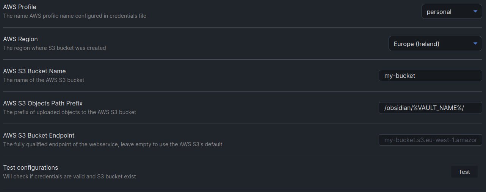

# Obsidian AWS S3 Sync Plugin

This [Obsidian.md](https://obsidian.md/) plugin allow to evaluate synchronize the vault with a remote AWS S3 Bucket.

## Features

- Upload changed files to bucket
- Delete trashed files from bucket
- Download new files from bucket
- Automatic synchronization

This plugin will load a list of remote files from bucket and local files from vault and elaborate sync changes:

Notifications will appear when sync process run:

)

## Requirements

- The `.aws/credentials` file present in user home and a valid configured profile.
- An S3 bucket.

## Installation

Download zip archive from [GitHub releases page](https://github.com/daaru00/obsidian-aws-s3-sync/releases) and extract it into `<vault>/.obsidian/plugins` directory.

## Configurations

Configure the required credentials and bucket section (profiles name will be loaded from `~/.aws/credentials` file):

Configure the sync behavior, the source (local or remote) will command which file will be create, updated or delete in the source:

Enable the automatic synchronization to run sync process on vault files changes:

You can also change the notifications behavior, if automatic synchronization is enable maybe you don't need the notice notification:

