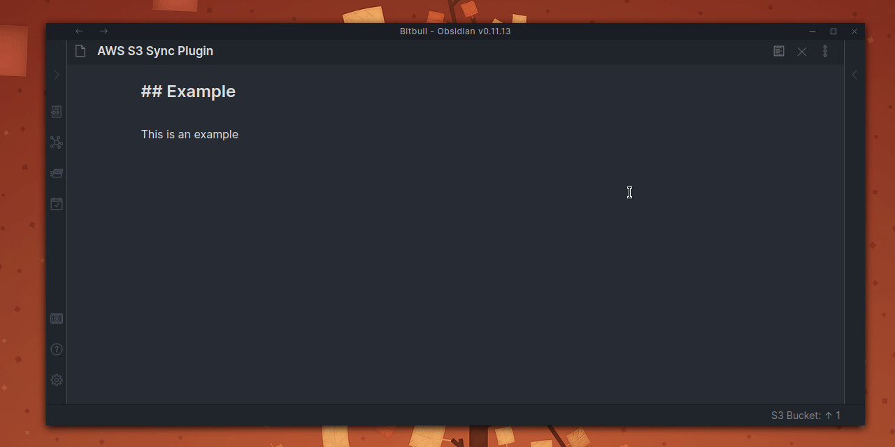
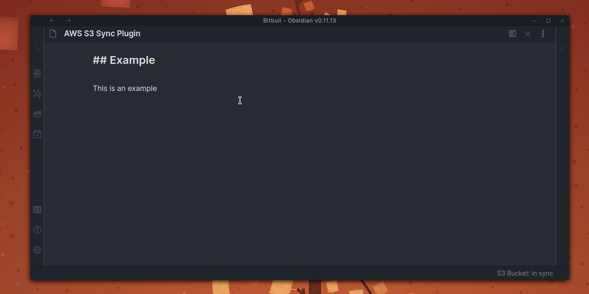
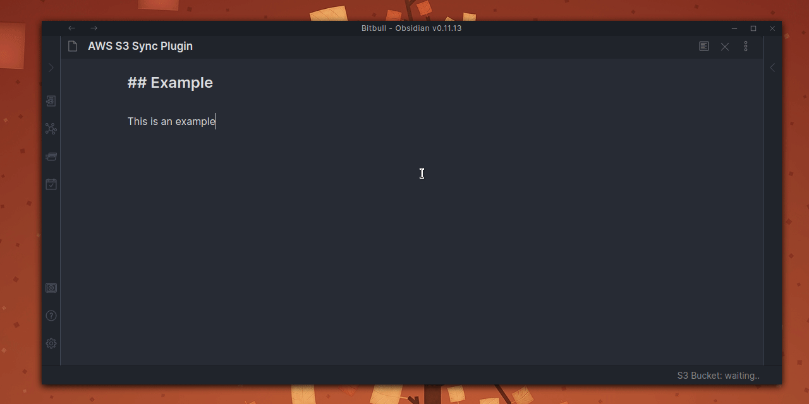

# Obsidian AWS S3 Sync Plugin

This [Obsidian.md](https://obsidian.md/) plugin allow to evaluate synchronize the vault with a remote AWS S3 Bucket.

## Usage

This plugin will load a list of remote files from bucket and local files from vault and elaborate sync changes:

Synchronization process can be triggered from command palette:

)

When automatic synchronization is enabled every file change (also create and delete) will trigger the synchronization process:

## Requirements

- The `.aws/credentials` file present in user home and a valid configured profile.
- An S3 bucket.

## Installation

Download zip archive from [GitHub releases page](https://github.com/daaru00/obsidian-aws-s3-sync/releases) and extract it into `<vault>/.obsidian/plugins` directory.

## Configurations

Configure the required credentials and bucket section (profiles name will be loaded from `~/.aws/credentials` file):

Configure the sync behavior, the source (local or remote) will command which file will be create, updated or delete in the source:

Enable the automatic synchronization to run sync process on vault files changes:

You can also change the notifications behavior, if automatic synchronization is enable maybe you don't need the notice notification:

## Limitations

### File bigger then 500mb

The synchronization flow use MD5 hash generation in order to be able to identify changed file based on the content. 
File bigger then 500mb will be skipped for performance reasons, so these files will be just uploaded if does not exist remotely or download if not exist locally.

### File bigger then 1GB

File bigger then 1GB cannot be uploaded due a S3 limitation fo basic upload, multipart upload currently is not implemented.
